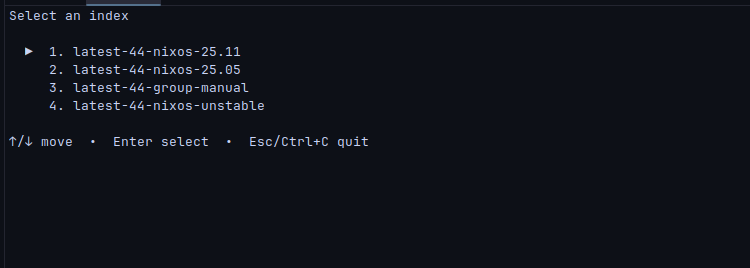
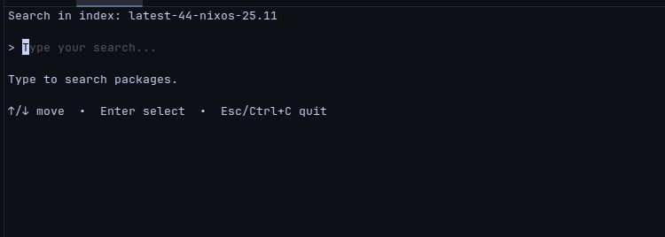
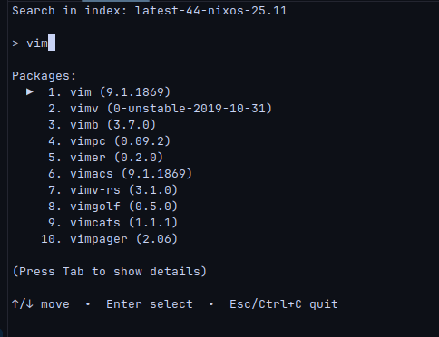
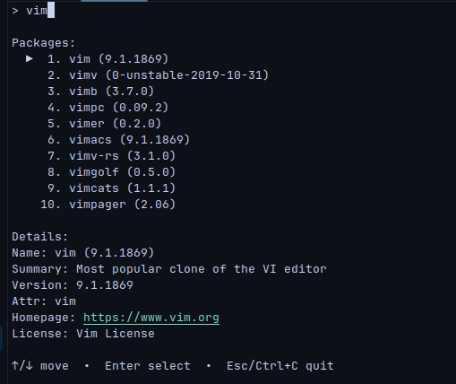

# StyleSearch

A Terminal User Interface (TUI) for searching NixOS packages, wrapping [search.nixos.org/packages](https://search.nixos.org/packages).

## What is this?

StyleSearch is a command-line tool that provides a prettier, interactive alternative to `nix search` for browsing NixOS packages. Instead of using a web browser or dealing with command-line output, you get a clean TUI that lets you:

- Browse available package indices
- Search packages with live feedback
- View package details (version, description, homepage, license, etc.)
- Copy package identifiers directly to your clipboard

## Features

- Fast, debounced search
- Pagination support for large result sets
- Clipboard integration (copies package attribute name on selection)
-  Keyboard-driven navigation
- Clean, minimal interface

## Installation

```bash
# Using Nix flakes
nix build .#nix-style-search

# Or run directly without building
nix run .#nix-style-search
```

## Usage

```bash
# After building with nix build
./result/bin/nix-style-search

# Or directly with nix run
nix run .#nix-style-search
```

### Keyboard Shortcuts

**Index Selection Screen:**
- `↑/↓` - Navigate indices
- `Enter` - Select index
- `Esc/Ctrl+C` - Quit

**Search Screen:**
- Type to search packages
- `↑/↓` - Navigate results
- `Tab` - Toggle package details
- `Enter` - Copy package to clipboard and quit
- `Esc/Ctrl+C` - Quit

## How It Works

StyleSearch queries the official NixOS search backend API (the same one that powers search.nixos.org) and presents the results in a terminal interface built with [Bubble Tea](https://github.com/charmbracelet/bubbletea).

## Building from Source

```bash
go build -o nix-style-search ./cmd/nix-style-search
```

## Screenshots 

**Index Selection Screen:**



---

**Empty Search:**



---

**Search Results (No Details):**



---

**Search Results (With Details):**




## License

Apache2.0 

*Note: This project is not affiliated with or endorsed by the NixOS project.*

